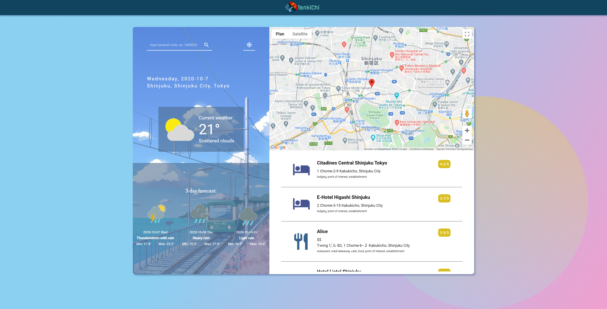

This project was bootstrapped with [Create React App](https://github.com/facebook/create-react-app).

## TenkiChi



## About TenkiChi
Web app giving you the weather and nearby stores around you with a postal code.

Input your desired postal code in the search form and click on the search icon to look for a place. You can also use the geolocalisation button to get your current position.

This web app only works for Japanese postal code and it has to be in following format.

ex: 1600022, 0691300, 1010032, etc.

You can access the web app with the link below:
https://tenkichijp.herokuapp.com/


### API used
- Google Map
- Google Geolocation
- Google Places
- Weatherbit.io

### Tech Stack
- Javascript
- Node Js
- Express
- React Js
- Sass

## Getting Started

The following commands are useful for running the application locally.

### Install

Install all required dependencies
```
yarn install
```

### Run locally
Start the application locally (default: localhost:3000)

```
yarn serve
```
### Run server locally
Start the application's server locally (default: localhost:9000)

```
yarn start
```
### Build the app for production
bundles React in production mode and optimizes the build for the best performance. 

```
yarn build
```

### `yarn start`

Runs the app in the development mode.<br />
Open [http://localhost:3000](http://localhost:3000) to view it in the browser.

The page will reload if you make edits.<br />
You will also see any lint errors in the console.

### `yarn test`

Launches the test runner in the interactive watch mode.<br />
See the section about [running tests](https://facebook.github.io/create-react-app/docs/running-tests) for more information.

### `yarn build`

Builds the app for production to the `build` folder.<br />
It correctly bundles React in production mode and optimizes the build for the best performance.